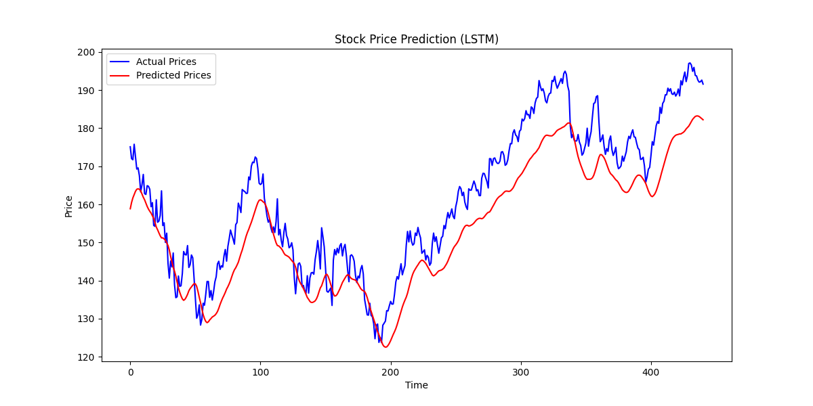

# AI Stock Price Prediction

[](https://github.com/Swyampatel/ai-stock-price-prediction.git)

This project predicts stock prices using Long Short-Term Memory (LSTM) models. Historical stock data is fetched using Yahoo Finance, preprocessed, and used to train a deep learning model. The predictions are visualized to compare actual vs. predicted prices.

---

## What I Learned

This project allowed me to gain and apply several key skills, including:

- **Time-Series Forecasting**:
  - Understanding sequential data and training LSTM models for better predictions.
- **Data Preprocessing**:
  - Scaling, reshaping, and preparing data for machine learning models.
- **Deep Learning**:
  - Building, training, and fine-tuning an LSTM model using TensorFlow.
- **Data Visualization**:
  - Using Matplotlib to visually compare actual and predicted results.
- **API Integration**:
  - Fetching live stock data using Yahoo Finance API (`yfinance` library).

## Sample Result



This plot shows the actual vs. predicted stock prices for the chosen stock ticker (`AAPL`). The user can update the stock ticker in the script to check predictions for other stocks.

---

## How to Use

1. Clone this repository:
   ```bash
   git clone https://github.com/Swyampatel/ai-stock-price-prediction.git
   ```

2. Navigate to the project directory:
   ```bash
   cd ai-stock-price-prediction
   ```

3. Install the required dependencies:
   ```bash
   pip install -r requirements.txt
   ```

4. Run the script:
   ```bash
   python train_model.py
   ```

5. Update the stock ticker:
   - Open `train_model.py` and update the `stock_ticker` variable to the desired stock symbol (e.g., `GOOGL`, `MSFT`, etc.).
---

## Future Improvements

- Adding additional stock indicators (e.g., volume, moving averages) for better accuracy.
- Extending the model to predict multiple steps ahead (e.g., next 5 days).
- Implementing a web interface for user interaction.

---


